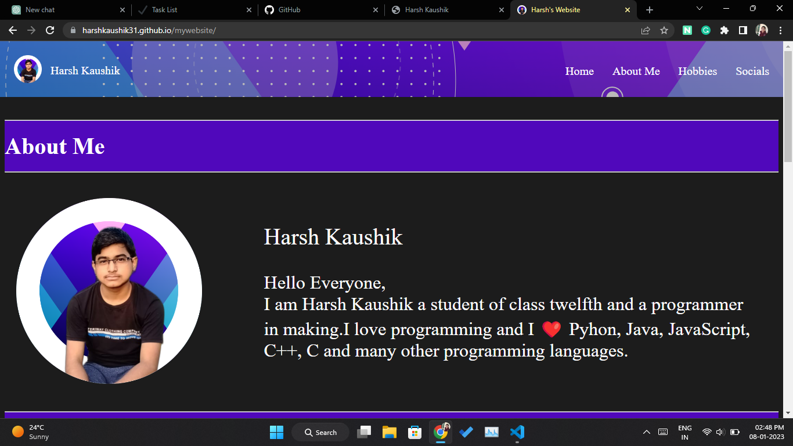

# Harsh's Project Portfolio


A clean and simple landing page to showcase a collection of my web development projects. This portfolio serves as a central hub, providing a brief overview and a direct link to each deployed project. The page is fully responsive, built with HTML, CSS, and Bootstrap.

## 🚀 Live Demo

[**View Live Site**](https://harshkaushik31.github.io/all-website/)


## 📸 Screenshot

A preview of the main landing page:

 

## ✨ Features

-   **Clean and Minimalist Design:** A simple user interface focusing on the projects.
-   **Responsive Layout:** Uses Bootstrap and custom CSS Flexbox to ensure a great experience on all devices (desktops, tablets, and mobile phones).
-   **Project Cards:** Each project is displayed in a card with an image, a title, a short description, and a direct link.
-   **Custom Styling:** Includes custom styles for buttons and layout for a unique look and feel.
-   **Easy to Navigate:** All projects are accessible from a single page.

## 📂 Projects Showcased

This portfolio page links to the following projects:

| # | Project Name                | Description                                     | Live Link                                                              |
|---|-----------------------------|-------------------------------------------------|------------------------------------------------------------------------|
| 1 | My Website                  | My personal portfolio website.                  | [Click Here](https://harshkaushik31.github.io/mywebsite/)                |
| 2 | My Cookie Clicker           | A fun and simple cookie clicker game.           | [Click Here](https://harshkaushik31.github.io/mycookieclicker/)          |
| 3 | My Clock                    | A functional real-time digital clock.           | [Click Here](https://harshkaushik31.github.io/myclock/)                  |
| 4 | My Rock Paper Scissor Game  | The classic Rock-Paper-Scissors game.           | [Click Here](https://harshkaushik31.github.io/rockpaperscissor/)         |
| 5 | My HTML CheatSheet          | A handy cheatsheet for HTML tags and concepts.  | [Click Here](https://harshkaushik31.github.io/WebDevCheatsheet/)         |
| 6 | MySQL CheatSheet            | A quick reference guide for MySQL commands.     | [Click Here](https://harshkaushik31.github.io/mysqlcheatsheet/)          |
| 7 | My TIC-TAC-TOE              | The classic Tic-Tac-Toe game.                   | [Click Here](https://harshkaushik31.github.io/tic-tac-toe/)              |
| 8 | My Calculator               | A basic web-based calculator.                   | [Click Here](https://harshkaushik31.github.io/mycalculator/)             |
| 9 | My Study Music Website      | A website providing music suitable for studying.| [Click Here](https://harshkaushik31.github.io/studymusic/)               |


## 🛠️ Technologies Used

-   **HTML5:** For the structure and content of the website.
-   **CSS3:** For custom styling, including Flexbox for layout and custom button effects.
-   **Bootstrap 5.3:** For the responsive grid system and pre-styled components like cards.

## 🔧 How to Use

This is a static website. To run it locally, follow these simple steps:

1.  **Clone the repository:**
    ```bash
    git clone [https://github.com/harshkaushik31/your-repository-name.git](https://github.com/harshkaushik31/your-repository-name.git)
    ```
2.  **Navigate to the project directory:**
    ```bash
    cd your-repository-name
    ```
3.  **Open the `index.html` file** in your favorite web browser.

That's it! You should see the website running locally.

## 👤 Author

-   **Harsh Kaushik**
-   GitHub: [@harshkaushik31](https://github.com/harshkaushik31)

